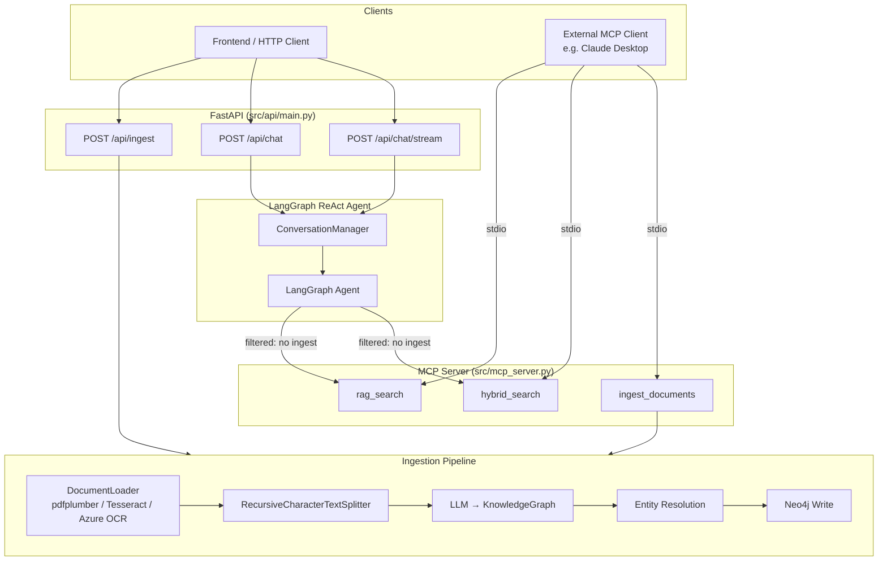

# Brainy Binder v2

AI-powered knowledge-base assistant backed by a **Neo4j graph store** and exposed as both a **FastAPI REST service** and an **MCP (Model Context Protocol) server**.

Documents are ingested through an OCR-aware pipeline, chunked, embedded, and stored as a hybrid vector + knowledge graph in Neo4j. A LangChain agent answers questions using RAG and graph-traversal search, accessible via chat API or any MCP-compatible client.

## Architecture



## Features

- **Dual search modes** — pure vector RAG and hybrid vector + knowledge-graph search
- **OCR pipeline** — pdfplumber for native PDFs, Tesseract for scanned documents, Azure Mistral OCR as high-confidence fallback
- **Knowledge graph extraction** — LLM-powered entity and relationship extraction with entity resolution and deduplication
- **Streaming chat** — Server-Sent Events (SSE) for real-time token streaming
- **MCP server** — exposes tools for direct integration with Claude Desktop or any MCP host
- **Prompt injection protection** — `ingest_documents` tool is filtered from the chat agent context

## Project Structure

```
src/
├── api/
│   ├── main.py          # FastAPI app, lifespan, endpoints
│   ├── agent.py         # LangChain agent + MCP client
│   └── conversation.py  # Thread-safe session history manager
├── ingestion/
│   ├── pipeline.py      # Orchestrates the full ingestion flow
│   ├── chunking.py      # RecursiveCharacterTextSplitter + vector index
│   ├── loaders.py       # Legacy document loaders
│   └── ingestion_mistral/
│       ├── document_loader.py  # Unified loader with format detection
│       ├── ocr_engine.py       # Tesseract + Azure Mistral OCR
│       └── pdf_extractor.py    # pdfplumber native text extraction
├── llm/
│   ├── services.py      # LLM and embedder functions
│   ├── answer_engine.py # RAG and hybrid search query execution
│   └── prompts.py       # Prompt builders
├── store/
│   ├── neo4j.py         # KG extraction, entity resolution, Neo4j writes
│   └── utils.py         # Label sanitization, name normalization
├── schema/
│   └── schema.py        # Pydantic models: Entity, Relationship, KnowledgeGraph
├── config.py            # Pydantic Settings (env-driven)
├── mcp_server.py        # FastMCP server entry point
└── cli.py               # Typer CLI (ingest + query commands)
```

## CLI

```bash
# Ingest documents from the default data/ directory
python -m src.cli ingest

# Ingest from a specific directory and reset the index first
python -m src.cli ingest --data-dir ./my-docs --reset-index

# First boolan argument for rag_search
# Second boolean argument for hybrid_search
python -m src.query "YOUR_QUESTION" false true
```

## API Reference

### Chat

| Method | Endpoint | Description |
|--------|----------|-------------|
| `POST` | `/api/chat` | Non-streaming chat, returns full response |
| `POST` | `/api/chat/stream` | Streaming chat via SSE |
| `GET` | `/api/chat/session/{session_id}/history` | Retrieve conversation history |
| `DELETE` | `/api/chat/session/{session_id}` | Clear session history |

**Request body (`/api/chat` and `/api/chat/stream`):**
```json
{
  "message": "What are the shipping routes for Q3?",
  "session_id": "optional-uuid-to-continue-a-session"
}
```

**Streaming response events:**
```
data: {"session_id": "abc-123"}
data: {"tool": "hybrid_search", "status": "completed"}
data: {"content": "Based on the documents..."}
data: {"status": "done"}
```

### Ingestion

| Method | Endpoint | Description |
|--------|----------|-------------|
| `POST` | `/api/ingest` | Upload files for ingestion (multipart/form-data) |

**Form fields:**
| Field | Type | Required | Description |
|-------|------|----------|-------------|
| `files` | `File[]` | Yes | One or more files to ingest |
| `reset_index` | `bool` | No (default: `false`) | Wipe Neo4j before ingesting |

**Supported file types:** `.pdf`, `.docx`, `.txt`, `.md`, `.png`, `.jpg`, `.jpeg`, `.tif`, `.tiff`, `.bmp`, `.gif`, `.webp`, `.heic`

**Max file size:** 50 MB per file (override with `INGEST_MAX_FILE_SIZE` env var)


#### Ingestion Pipeline

```
(i.) File upload / data_dir
       
(ii.) DocumentLoader (format detection)
        ├── PDF  → pdfplumber (native text)
        │        → Tesseract OCR (scanned)
        │        → Azure Mistral OCR (fallback, confidence < 60%)
        ├── Image → Tesseract → Azure Mistral OCR
        └── Text → direct read
      
(iii.) RecursiveCharacterTextSplitter (chunk_size=1000, overlap=300)
      
(iv.) Per-chunk: LLM structured extraction → KnowledgeGraph (Entities + Relationships)
       
(v.) Entity Resolution
  - normalize names (strip titles, lowercase)
  - merge exact + short-name duplicates
  - transitive alias mapping

(vi.) Neo4j Write
        ├── Document node
        ├── Chunk nodes (with embedding vectors)
        ├── Entity nodes (with type labels)
        └── Edges: HAS_CHUNK, MENTIONS, domain relationships
```

### Health

| Method | Endpoint | Description |
|--------|----------|-------------|
| `GET` | `/health` | Service health + active session count |
| `GET` | `/api/health` | API health check |

## MCP Tools

When connecting an MCP client directly to `src.mcp_server`:

| Tool | Description |
|------|-------------|
| `rag_search(question)` | Vector RAG search over ingested documents |
| `hybrid_search(question)` | Vector + knowledge-graph search |
| `ingest_documents(data_dir?, reset_index?)` | Ingest documents from a local directory |

## Environment Variables

| Variable | Description |
|----------|-------------|
| `NEO4J_URI` | Neo4j bolt connection URI |
| `NEO4J_USERNAME` | Neo4j username |
| `NEO4J_PASSWORD` | Neo4j password |
| `NEO4J_DATABASE` | Neo4j database name |
| `OPENAI_API_KEY` | OpenAI API key (LLM + embeddings) |
| `AZURE_MISTRAL_OCR_ENDPOINT` | Azure-hosted Mistral OCR endpoint URL |
| `AZURE_API_KEY` | Azure API key for Mistral OCR |
| `AZURE_MISTRAL_OCR_MODEL` | Azure OCR model name (default: `mistral-wizonix-ocr`) |

